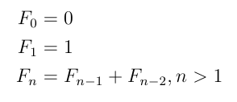
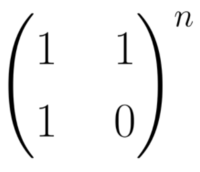
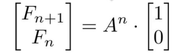
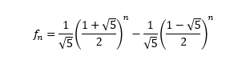

# Fibonacci nth element calculator
This project was created to practice implementing differents approches to calculate the Fibonacci nth element. Then estimate the execution time of each method.
The Double type was used as a return type of the calculator (Max value of Double is `1.7976931348623157e308`)
## Technologies :
- Java 11
- JAMA for Matrix calculations 
- JCommander for command line args handling
- Stopwatch from apache-commons

## Fibonacci methods :
### Recursive
  
Not efficient
### Tail Recursive
To avoid stackoverflow issue
### Iterative
Loop over n and keep track of the last two values
### Matrix
The matrix A is :  
  
Then  

### Closed-Form


## Tests
#### n=5
``` 
Closed-Form    :  Fib(5)=8  in 0ms (827 microsec)
Tail Recursive :  Fib(5)=8  in 0ms (855 microsec)
Iterative      :  Fib(5)=8  in 0ms (586 microsec)
Matrix         :  Fib(5)=8  in 3ms (3018 microsec)
Recursive      :  Fib(5)=8  in 3ms (3251 microsec)
```
#### n=20
``` 
Closed-Form    :  Fib(20)=10946  in 0ms (846 microsec)
Tail Recursive :  Fib(20)=10946  in 0ms (735 microsec)
Iterative      :  Fib(20)=10946  in 0ms (890 microsec)
Matrix         :  Fib(20)=10946  in 3ms (3338 microsec)
Recursive      :  Fib(20)=10946  in 4ms (4910 microsec)
```

#### n=50
``` 
Closed-Form    :  Fib(50)=20365011074  in 2ms (2774 microsec)
Tail Recursive :  Fib(50)=20365011074  in 0ms (805 microsec)
Iterative      :  Fib(50)=20365011074  in 1ms (1010 microsec)
Matrix         :  Fib(50)=20365011074  in 2ms (2379 microsec)
Recursive      :  takes a lot of time
```

#### n=100
``` 
Closed-Form    :  Fib(100)=573147844013819040000 in 2 ms (2748 microsec)
Tail Recursive :  Fib(100)=573147844013817200000 in 0 ms (846 microsec)
Iterative      :  Fib(100)=573147844013817200000 in 0 ms (938 microsec)
Matrix         :  Fib(100)=573147844013817200000 in 2 ms (2498 microsec)
Recursive      :  takes a lot of time
```

#### n=200 (Long type can't handle big values)
``` 
Closed-Form    :  Fib(200)=453973694165311000000000000000000000000000 in 2 ms (2619 microsec)
Tail Recursive :  Fib(200)=453973694165308000000000000000000000000000 in 0 ms (899 microsec)
Iterative      :  Fib(200)=453973694165308000000000000000000000000000 in 1 ms (1235 microsec)
Matrix         :  Fib(200)=453973694165308000000000000000000000000000 in 2 ms (2517 microsec)
Recursive      :  takes a lot of time
```